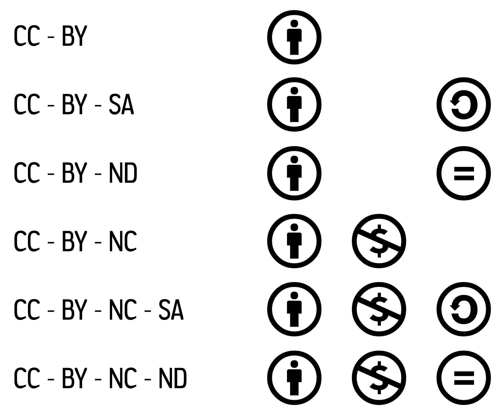

Licenze
=======

Vengono esplorate tre tipologie di licenze usate nell’ambito della distribuzione di informazione e dati liberi: la più famosa famiglia di licenze Creative Commons, la licenza creata dalla Pubblica Amministrazione italiana IODL, ed infine la licenza ODBL, nata per sopperire alle mancanze delle Creative Commons in merito alla gestione di banche dati all’interno di diverse legislazioni.

Creative Commons
----------------

Le licenze Creative Commons, attualmente alla versione 4.0 (2013), forniscono tre livelli di lettura:

-   Legal Code: il primo livello è il testo completo della licenza, esso vale come strumento legale;

-   Human Readable Summary, o Atto Commons: è una sintesi dei principali punti del legal code;

-   Machine Readable: descrizione della licenza riutilizzabile dai software per ricercare contenuti.

### ccREL

La versione Machine Readable è sviluppata come un insieme di metadati scritti sotto forma di *triple* nel **ccREL**(Creative Commons Right Expressing Language), basato sullo standard RDF[^1], che possono facilmente essere integrati in documenti digitali: usando lo standard RDFa per le pagine web, oppure XMP ed RDF/XML per file multimediali.

Esso definisce due tipi di proprietà, una legata all’opera (`wWork`), l’altra legata alla licenza (`license`).

Per descrivere un’opera si usano

-   `xhtml:license`, scritto semplicemente `license` in pagine web (implicito)[^2]

-   `dct:title`[^3]

-   `cc:attributionName`

-   `cc:attributionURL`

-   `dct:type`

-   `dct:source` se l’opera è riadattata da un’altra

-   `cc:morePermissions` se l’opera fornisce eccezioni alla licenza

Per descrivere una licenza si usano le proprietà `license`: i metadati specifici della licenza sono accessibili seguendo l’URL in (xhtml:)license.

A titolo di esempio, si propone una descrizione RDFa di questo testo[^4]

```xml
<span xmlns:dct="http://purl.org/dc/terms/" property="dct:title">Dati aperti e riuso</span> di <a xmlns:cc="http://creativecommons.org/ns#" href="https://www.gitbook.io/book/sabas/datiapertibook" property="cc:attributionName" rel="cc:attributionURL">Stefano Sabatini</a> è distribuito con Licenza <a rel="license" href="http://creativecommons.org/licenses/by/4.0/">Creative Commons Attribuzione 4.0 Internazionale</a>.
```
che codifica questi metadati:

| Funzione | Namespace RDF                  | Proprietà          | Valore                                      |
|----------|--------------------------------|--------------------|---------------------------------------------|
| Titolo   | http://purl.org/dc/terms/      | dct:title          | Dati aperti e riuso          |
| Autore   | http://creativecommons.org/ns# | cc:attributionName | Stefano Sabatini                            |
| Url      | http://creativecommons.org/ns# | cc:attributionURL  | https://www.gitbook.io/book/sabas/datiapertibook           |
| Licenza  | http://www.w3.org/1999/xhtml   | (xhtml:license)    | http://creativecommons.org/licenses/by/4.0/ |

### Porting

Le Creative Commons sono nate in America, scritte in inglese avendo inizialmente come riferimento la legislazione americana, anche se col progredire delle versioni si è guardato sempre più alla legislazione internazionale (trattati sul copyright). Per questo motivo sono state prodotte da tecnici di alcune comunità locali (affiliati) delle versioni che, oltre ad essere tradotte nella lingua nazionale, sono adattate dove richiesto alla legislazione di riferimento.

Nelle versioni precedenti alla 3.0 si parlava di **licenza generica** per la versione internazionale -e questa si conformava principalmente alla legislazione statunitense-, mentre per la versione 3.0 si parla di **licenza internazionale** o **unported**, e si assumono come base le principali convenzioni internazionali sul diritto d’autore (dalla Convenzione di Berna del 1886 in avanti). Questo per distinguere le versioni adattate alla legislazione locale, che vengono definite **ported**.

Al Global Summit del 2011[^5] si è iniziato il lavoro sulla generazione di licenze 4.0, proponendo di lavorare su due aspetti principali:

-   la copertura del diritto *sui generis* sui database, attualmente non ’supportata’ dalla versione internazionale[6];

-   l’abbandono dell’adattamento delle licenze, facendo in modo che si renda necessaria soltanto la traduzione.

Il secondo aspetto è supportato da alcuni dati[^7] che evidenziano come il porting sia una scelta svantaggiosa:

-   55 giurisdizioni su 71 hanno condotto almeno un porting;

-   solo metà hanno condotto il porting della versione 3.0;

-   alla fine del 2011 il 72% dei lavori licenziati sotto CC usava la versione internazionale.

Sin dalle varie bozze di discussione, la versione 4.0 ha coinvolto esperti della rete di affiliati[^8] per assicurare che il testo legale comprendesse le terminologie riconosciute dalle varie legislazioni in modo da render non necessario l’adattamento. Si è quindi migliorata l’internazionalizzazione (è necessaria solo la traduzione) e l’interoperabilità con altre tipologie di licenze.

Alcuni cambiamenti includono:

-   copertura dei diritti *sui generis* sui database nelle legislazioni che li prevedono: il compilatore di una raccolta di dati mantiene la proprietà della sua raccolta al di là del copyright dei singoli contenuti, pertanto vengono inserite condizioni che permettono riuso, ricerca ed estrazione sui database, tenendo in considerazione anche il concetto di “adattamento” di una base di dati (il riutilizzo di tutta o una porzione significativa del database stesso);

-   altri diritti affini al copyright sono trattati tramite una estensione della definizione di lavoro (*work*), come il diritto di trasmissione o di registrazione di una performance artistica;

-   una limitazione dell’applicazione dei diritti morali al fine di prevenirne l’applicazione per limitare usi garantiti dalla licenza stessa;

-   nel caso di cessazione di validità della licenza in seguito ad una violazione di una condizione, la licenza viene ripristinata se viene posto rimedio entro 30 giorni dall’attestazione della violazione (non escludendo risarcimenti danni eventuali).

### Clausole e licenze supportate

Abbiamo affermato in precedenza che le licenze Creative Commons conservano solo alcuni diritti, quelli che sono ritenuti necessari dal creatore dell’opera. Questi diritti si traducono nelle quattro clausole di licenza, che vengono combinate tra loro nelle sei licenze supportate attualmente (altre sono state deprecate, ed alcune combinazioni sono impossibili per incompatibilità fra le clausole).

Le clausole sono:

-   BY (Attribution - Attribuzione): il diritto di base[^9] chiede solo che venga conservato l’autore dell’opera originale;

-   SA (Share Alike - Condividi Allo Stesso Modo): viene chiesto di mantenere la stessa licenza, non introducendo altre restrizioni;

-   NC (Non Commercial - Non Commerciale): non è possibile utilizzare l’opera a scopo commerciale;

-   ND (No Derivative - No Derivati): non è possibile rielaborare l’opera, ma solo utilizzare e fare copie identiche.

Da queste si deduce che le libertà che uno ha relativamente ad un’opera possono essere Condivisione (*Share*) e Riuso (*Remix*).



Le combinazioni supportate sono:

-   BY

-   BY-SA

-   BY-ND

-   BY-NC

-   BY-NC-SA

-   BY-NC-ND

Di queste licenze le uniche compatibili con le definizioni di conoscenza libera fornite in precedenza sono le prime due. Infatti, considerando l’Open Definition, le clausole NC e ND contrastano con i punti 2 e 3.

Per la Free Software Foundation la clausola ND è invece compatibile con la Free Documentation License.

### Donazione al pubblico dominio

Al set di licenze si aggiunge la trattazione del Pubblico Dominio (PD): le opere in pubblico dominio sono quelle per le quali il copyright è scaduto o non è applicabile (negli Stati Uniti i documenti prodotti dal Governo sono esclusi dal copyright). In molte legislazioni non è previsto (o è molto difficile) dichiarare opere di pubblico dominio a meno che ricadano nei casi espressi dalla legge, pertanto Creative Commons prevede due strumenti -non licenze- dedicati allo scopo di individuare un’opera e dichiarare che essa è in Pubblico Dominio.

Per le opere che sono venute a scadenza naturale o non rientrano nel copyright è previsto il **Public Domain Mark**[^10] (Marchio di Pubblico Dominio), una ”etichetta” applicabile alle opere prive di copyright a livello mondiale, escludendo ad esempio opere prive di copyright in solamente alcune legislazioni.

Per le opere che vogliono essere messe nel pubblico dominio dall’autore stesso è previsto lo strumento **CC Zero**[^11] col quale l’autore può dedicare la sua opera rinunciando a tutti i diritti: attualmente è lo strumento che provvede l’alternativa più completa e universale data la varietà della legislazione in merito.

IODL 1.0/2.0
------------

Il centro di formazione per l’ammodernamento della PA, Formez, ha prodotto una licenza specifica per le Pubbliche Amministrazioni italiane denominata Italian Open Data License che è al momento la più usata dagli enti italiani. Esistono due versioni: la 1.0[^12], pubblicata il 17 Aprile 2011, e la 2.0[^13], pubblicata l’8 Marzo 2012.

Entrambe le versioni propongono come libertà il riuso e la rielaborazione dell’opera, ma differiscono nei diritti riservati: in entrambe è richiesta l’attribuzione, ma solamente nella prima è richiesta la condivisione allo stesso modo.

Sono licenze Open nel senso della Open Definition e sono dichiarate esplicitamente compatibili con le licenze Creative Commons e Open Data Commons[^14] che hanno le medesime clausole: per la 1.0 le licenze compatibili sono CC-BY-SA 3.0 e ODBL, la 2.0 CC-BY 3.0 e ODC-BY.

ODBL
----

La licenza ODBL nasce nel 2009 da una collaborazione fra l’Open Data Commons (OKFN) e la OpenStreetMap Foundation, la fondazione che supporta l’omonimo progetto, al fine di sostituire la licenza in vigore[^15] fino a quel momento, la CC-BY-SA. Questo passaggio si è reso necessario per tutelare maggiormente il progetto, costituito in sostanza da un grande database geografico: come accennato in precedenza, i database non sono tutelati da varie legislazioni e nella licenza utilizzata non si fa cenno all’argomento.

La licenza[^16] dà diritto a

-   usare il database;

-   estrarre e riutilizzare i contenuti;

-   derivare e includerlo in collezioni;

a condizione che

-   venga trasmesso sotto la stessa licenza o compatibile;

-   venga allegata o linkata la licenza;

-   venga mantenuta l’attribuzione (insieme o in altro posto raggiungibile).

La condizione di Condivisione allo stesso modo è spiegata maggiormente:

-   non bisogna applicare la licenza a collezioni di database (ma vale per il database e derivati inclusi nella condizione), a database derivati di uso privato;

-   i database derivati o lavori prodotti da database devono essere corredati da una copia machine readable dell’intero database oppure da un file che contiene i cambiamenti al database originale;

-   le due condizioni precedenti devono essere soddisfatte con costi che coprano al massimo la riproduzione (ma non devono esserci se distribuiti via internet);

-   si possono introdurre restrizioni tecnologiche solo se si rende disponibile anche una versione senza restrizioni.

Nelle definizioni si chiarisce che:

-   database: è una collezione di contenuti ordinati sistematicamente e accessibili individualmente per via elettronica;

-   collezione di database: il database è incluso in una collezione di database indipendenti, non è un database derivato;

-   database derivato: è un database che si basa su un altro database su cui si è operato per traduzione, adattamento, modifica, riordinamento od altro su tutto o su una parte sostanziale dei contenuti;

-   opera prodotta: opera (immagine, materiale scritto o audiovisivo) risultante dall’uso (via ricerca o query) di tutto o una parte sostanziale del database, di un database derivato o del database incluso in una collezione.

Fino all’introduzione nella versione internazionale delle Creative Commons della trattazione del diritto *sui generis*, la ODBL è stata l’unica licenza focalizzata ai diversi aspetti della legislazione riguardante le basi di dati.

****
[^1]: <http://wiki.creativecommons.org/images/d/d6/Ccrel-1.0.pdf>

[^2]: Questo poiché si è stabilito, a seguito dell’introduzione della proprietà *license* nel 2005 dal XHTML Working Group, di dichiarare equivalente la nozione CC - <http://creativecommons.org/ns#license> - a quella XHTML -<http://www.w3.org/1999/xhtml/vocab/#license> -

[^3]: Usando il namespace del Dublin Core Metadata <http://dublincore.org/documents/2012/06/14/dcmi-terms/?v=elements#>

[^4]: Prodotta tramite <http://creativecommons.org/choose/>

[^5]: <http://governancexborders.com/2011/09/16/cc-global-summit-2011-the-end-of-the-porting-experiment/>

[^6]: Con l’introduzione nella legislazione europea della protezione sui database si è deciso di includere, nelle [versioni ported delle nazioni europee delle licenze](http://wiki.creativecommons.org/images/f/f6/V3_Database_Rights.pdf), i database nella definizione di opera con le condizioni
    -   che venga incluso solo nelle localizzazioni dei paesi in cui esiste la protezione dei database;
    -   che definisca i limiti territoriali in cui questi diritti vengono applicati;
    -   che non venga applicato ad oggetti non protetti da copyright (fatti, idee, informazioni, eccetera)

[^7]: <http://www.technollama.co.uk/cc-4-0-an-end-to-porting-creative-commons-licenses>

[^8]: Più di 100 persone in 70 diverse giurisdizioni <http://wiki.creativecommons.org/CC_Affiliate_Network>

[^9]: Dalla versione 2.0 l’Attribuzione è richiesta da ogni licenza supportata

[^10]: <http://creativecommons.org/publicdomain/mark/1.0/deed.it>

[^11]: <https://creativecommons.org/publicdomain/zero/1.0/deed.it>

[^12]: <http://www.formez.it/iodl>

[^13]: <http://www.dati.gov.it/iodl/2.0/>

[^14]: Open Data Commons (<http://opendatacommons.org/>) è un progetto della Open Knowledge Foundation.

[^15]: Il passaggio è avvenuto solamente il 17 Settembre 2012

[^16]: <http://opendatacommons.org/licenses/odbl/1.0/>
