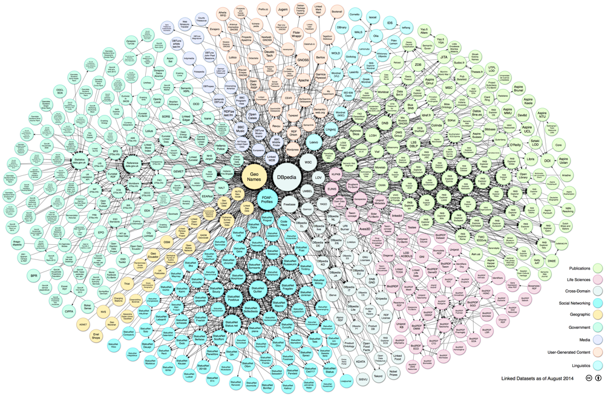

Linked open data
================

Tim Berners-Lee esprime nel Settembre 1998[^1] la sua visione di cosa debba diventare il Web, spiegando che la sua architettura deve evolvere dal rendere facile la comunicazione tra gli uomini al facilitare anche la comunicazione fra le macchine. Per fare questo, egli spiega che le informazioni debbano essere espresse in una forma che sia processabile anche dai computer.

Dalla rete degli ipertesti, il web deve diventare anche la rete dei dati, ovvero il **Web Semantico**. Per rendere l’informazione esplorabile, bisogna introdurre il concetto di link anche nei dati, ottenendo così i **linked data**.

Il web dei dati ha quattro regole:

1.  Gli oggetti devono avere nomi composti (esser identificati) da URI[^2].

2.  Gli URI devono seguire le specifiche del protocollo HTTP per permettere la ricerca dei nomi.

3.  Quando vengono accedute risorse tramite URI, bisogna rispondere con informazioni utili usando standard definiti (RDF, SPARQL).

4.  Bisogna includere link ad altri URI, per permettere di scoprire più oggetti.

Classificazione di Berners-Lee
------------------------------

Quando si parla di Open Data ci si chiede come sia possibile realizzarli, e Berners-Lee nel 2010 ha aggiunto alle sue definizioni di linked data una classificazione a stelle per valutare quanto sia “buono” un dato esposto in modo aperto:

##### Una stella

Il dato pubblicato sul web per ottenere una stella deve essere posto sotto una licenza libera (OL, Open License).

La condizione sulla licenza è l’unica da soddisfare, infatti viene specificato “qualunque formato”.

Il documento contenente il dato è accessibile, riusabile e condivisibile, ma non è manipolabile facilmente.

Ad esempio un file in formato PDF otterrà una stella, così come una scannerizzazione di un documento.

##### Due stelle

Un dato a cui sono assegnate due stelle è un documento strutturato leggibile da una macchina e riusabile (RE, Reusable), ma in un formato proprietario.

##### Tre stelle

La terza stella viene assegnata ad un documento che possiede già due stelle, ma che viene rilasciato in un formato non proprietario (OF, Open Format).

##### Quattro Stelle

Il passaggio dalle tre alle quattro stelle è quello più complicato, perché richiede che i dati siano identificati (URI, Uniform Resource Identifier) con degli standard come il Resource Description Framework (RDF).

##### Cinque Stelle

L’ultima stella viene aggiunta quando il dato è finalmente integrato con altri dati nel Web (LD, Linked Data), ovvero quando esistono link in entrata da o in uscita verso altri datastore.

RDF
---

Per creare il Web dei dati è necessario introdurre informazioni sui dati stessi, ovvero i *metadati*.

I metadati sono informazioni strutturate che consentono di descrivere, localizzare o usare più facilmente i dati e gli oggetti. Il concetto è vecchio quanto i sistemi di classificazione (ad esempio la Classificazione Decimale Dewey usata nella catalogazione bibliotecaria risale al 1876), ma il termine viene usato per la prima volta nel 1968[^3]. I metadati si possono distinguere in tre famiglie:

-   **descrittivi** (identificano un oggetto),

-   **strutturali** (descrivono la composizione di un oggetto),

-   **amministrativi** (informano sulla gestione di un oggetto).

Questi metadati sono legati alla risorsa che descrivono da un URI univoco. Lo standard per codificare questo modello è noto come Resource Description Framework, in breve RDF[^4]: esistono diversi metodi per rappresentare il modello dei dati, tra i quali si segnalano RDF/XML (RDF in sintassi XML) e RDFa (RDF in Attributes, che estende XHTML per integrare metadati nei documenti web).

Una risorsa è descritta da una o più *statement* -o asserzioni- composte da tre oggetti (da cui **tripla**):

-   il **soggetto**,

-   una **proprietà** (o **predicato**),

-   l’**oggetto** (o *valore* della proprietà).

Le risorse si legano tra loro in un grafo: infatti le proprietà possono avere valori costituiti da altre risorse e le proprietà stesse sono rappresentabili come archi.

### RDF/XML

Una delle sintassi più usate per rappresentare un grafo RDF è basata su XML[^5].

I soggetti di una tripla sono rappresentati da un elemento XML con elementi figli rappresentati dalle proprietà con i rispettivi valori. Nel caso un nodo non abbia figli, esso è rappresentato come un elemento vuoto.

Nel caso in cui il contenuto di una proprietà sia una stringa, questa proprietà può venir rappresentata come attributo del nodo.

I namespace XML (rappresentati da un prefisso nelle proprietà) identificano i **vocabolari**. Un nome più formale utilizzato per i vocabolari è quello di **ontologia**, ma, come asserito dal W3C[^6], la differenza sta proprio nei contesti in cui vengono scritti: si preferisce parlare di ontologia quando si trattano formalmente collezioni complesse di termini.

Le relazioni fra le risorse e le proprietà sono descritte tramite un RDF Schema[^7], il linguaggio per la descrizione dei *vocabolari* che, a sua volta, è un vocabolario identificato dal namespace con prefisso `rdfs`[^8]. Lo spazio dei nomi radice è invece identificato dal prefisso `rdf`.

Per elencare più risorse si usano i *contenitori* -`rdf:Container`-** Bag** (lista non ordinata -`rdf:Bag`-), **Sequence** (lista ordinata-`rdf:Seq`-), **Alternative** (lista di cui il valore valido è solo uno -`rdf:Alt`-).

Le classi sono gruppi di risorse descritte da proprietà: le risorse sono istanza (`rdf:type`) della classe. Più classi possono avere lo stesso insieme di istanze, ma diverse proprietà.

Le proprietà sono descritte da un *dominio* di applicabilità (in una tripla, la risorsa è della classe specificata dal dominio della proprietà) e da un *range *(il valore è della classe specificata dal range della proprietà).

Il vocabolario principale RDF Schema ha namespace (abbreviato `xmlns`) `rdfs`.

L’esempio dell’attribuzione di questo testo nel formato RDF/XML diventa come nel listato seguente.

```xml
<?xml version="1.0" encoding="UTF-8"?>
<rdf:RDF xmlns:xhtml="http://www.w3.org/1999/xhtml/vocab#"
    xmlns:dct="http://purl.org/dc/terms/"
    xmlns:cc="http://creativecommons.org/ns#"
    xmlns:rdf="http://www.w3.org/1999/02/22-rdf-syntax-ns#">
    <rdf:Description rdf:about="https://www.gitbook.io/book/sabas/datiapertibook">
    <dct:title>Dati aperti e riuso</dct:title>
    <cc:attributionName>Stefano Sabatini</cc:attributionName>
    <xhtml:license rdf:resource="http://creativecommons.org/licenses/by/4.0/"/>
</rdf:Description>
```

### RDFa

RDFa, ovvero *Resource Description Framework in Attributes* è una Raccomandazione del W3C[^9] che estende i linguaggi basati su XML come XHTML ed HTML5 introducendo un insieme di attributi che permettono di integrare metadati riconducibili alle triple RDF per fornire una metadatazione automatica dei documenti.

Inizialmente proposto per XHTML 2.0 (specifica poi abbandonata), il gruppo di lavoro ha introdotto un modulo per XHTML 1 che ha raggiunto lo status di Raccomandazione nell’ottobre del 2008. La revisione 1.1, che abbandona il requisito dei namespace XML rendendone possibile l’utilizzo all’interno di documenti HTML, è diventata Raccomandazione nel 2012.

Le informazioni sulla proprietà intellettuale di un documento possono essere descritte tramite metadati riconoscibili automaticamente con il linguaggio ccREL, che applica i concetti dell’RDFa alle licenze Creative Commons. Ad esempio il listato sottostante.

```html
<span xmlns:dct="http://purl.org/dc/terms/" property="dct:title">Dati aperti e riuso</span>
di <a xmlns:cc="http://creativecommons.org/ns#" href="https://www.gitbook.io/book/sabas/datiapertibook" property="cc:attributionName" rel="cc:attributionURL">Stefano Sabatini</a>
è distribuito con Licenza <a rel="license" href="http://creativecommons.org/licenses/by/4.0/">Creative Commons Attribuzione 4.0 Internazionale</a>.
```

Si può notare come:

-   vengano usati i namespace per indicare l’URI dell’attributo;

-   il soggetto sia il documento stesso;

-   l’attributo *property* sia la proprietà della tripla;

-   il predicato sia il contenuto del tag a cui è applicata la proprietà;

-   l’attributo *rel* venga usato come proprietà per l’oggetto href (non può prendere il valore testuale, nel caso non ci sia href, prende come valore quello degli eventuali nodi figli).

Nel caso dei link (tag `<a>`), l’attributo property, invece di avere il contenuto del tag `<a>` come valore, ha come valore quello dell’attributo `href`. Se però si vuole definire il valore dell’attributo manualmente, si può usare l’attributo `content` (lasciando ad esempio la versione human-readable come valore visibile).

Un insieme uniforme di tag con proprietà provenienti dallo stesso vocabolario può dichiarare questo nel tag genitore usando l’attributo `vocab`, evitando di ripetere in ognuno l’URI completo. Se appartengono allo stesso oggetto (o classe), quest’ultimo si può dichiarare con l’attributo `typeof`.

### Vocabolari

In fase di definizione di uno schema per una applicazione è utile fare uso di vocabolari preesistenti quando ci si trova a voler definire una relazione o una proprietà.

Molti schemi sono già stati definiti, e qui citiamo i seguenti:

-   **FOAF**[^10], acronimo di Friend Of A Friend, è un dizionario (nato nel 2000 ed aggiornato nel 2008) dedicato alla descrizione di reti, che siano sociali o informative: fornisce strumenti per evidenziare e descrivere persone e connessioni. Ad esempio, nella specifica[^11] si vede che una persona (`foaf:Person`) è una sottoclasse di Agente (`foaf:Agent`) che raccoglie anche una azienda (`foaf:Organization`); le proprietà descrivibili vanno dal nome (`foaf:firstName`, implica che la risorsa sia un `foaf:Person`) agli account su vari network (`foaf:skypeID`, `foaf:jabberID`, i quali appartengono a `foaf:OnlineChatAccount` che è sottoclasse di `foaf:OnlineAccount`).

-   **DC**[^12], acronimo di Dublin Core, deriva da un sistema prodotto nel 1995 ed ha lo scopo di descrivere risorse digitali accessibili in rete. Il set principale di metadati, l’Element Set (DCES), consta di quindici elementi (che vengono preceduti dal namespace `dc` o `dct`[^13]): `contributor`, `coverage`, `creator`, `date`, `description`, `format` (MIME), `identifier`, `language`, `publisher`, `relation`, `rights`, `source`, `subject`, `title`, `type` (i valori di quest’ultimo sono controllati tramite vocabolario DCMI `type`).

-   **SKOS**[^14] è una specifica del W3C per l’organizzazione della conoscenza. I termini del vocabolario[^15] descrivono schemi di concetti e relazioni semantiche (`narrower`, `broader`, `related`).

-   **GN**[^16] è l’ontologia creata per il database Geonames[^17] che raccoglie più di dieci milioni di feature geografiche, la loro classificazione e la posizione. L’ontologia permette di descrivere codici di avviamento postale (`gn:postalCode`), le feature vicine (`gn:nearby`) e organizzazioni genitore/figlio (`gn:children`, ad esempio questo è il caso degli stati contenuti in un continente, essi sono figli del continente a fini della rappresentazione).

-   **WGS84_pos**[^18] è un semplice dizionario che descrive un oggetto spaziale (`wgs84_pos:SpatialThing`) rappresentato da un punto (`wgs84_pos:Point`), le sue coordinate e l’altitudine nel sistema di riferimento WGS84 (`wgs84_pos:lat`, `wgs84_pos:long`, `wgs84_pos:alt`).

### TURTLE e SPARQL

SPARQL (acronimo ricorsivo per SPARQL Protocol And RDF Query Language) è un linguaggio simile allo SQL che permette di interrogare e manipolare dati in lettura nel formato RDF. Le raccolte di dati RDF (datastores) hanno un punto di accesso in cui scrivere le query detto **endpoint.**

SPARQL è basato sulla sintassi TURTLE[^19], la quale permette di descrivere i grafi RDF in un modo più vicino al linguaggio naturale rispetto ad RDF/XML:

-   Le risorse sono rappresentate da IRI[^20] racchiusi tra coppie di parentesi uncinate `<>`.

-   Si definisce eventualmente una base per i nomi che formeranno gli IRI con la direttiva `@base`.

-   Eventuali altre basi sono definite tramite prefissi (che verranno anteposti dove necessario) con la direttiva `@prefix`.

-   Un predicato `type` (in RDF/XML rdf:type, la relazione “istanza di”) è abbreviato da `a`.

-   Le triple sono terminate da un punto.

-   Il punto e virgola separa elenchi di proprietà e valori relativi allo stesso soggetto.

-   Alle stringhe (literal) possono venir assegnate lingua (aggiungendo dopo di essa `@` seguito dal codice di due lettere) e tipo (aggiungendo dopo di essa `^^` seguito da un datatype XML con namespace `xsd`).

Ad esempio la descrizione di questa prova finale fornita in precedenza viene riscritta in Turtle[^21] come si può vedere nel listato seguente.

```rdf
    @prefix xhtml: <http://www.w3.org/1999/xhtml/vocab#>.
    @prefix dct: <http://purl.org/dc/terms/>.
    @prefix cc: <http://creativecommons.org/ns#>.
    <http://www.stefanosabatini.eu/thesis/>
      dct:title "Distribuzione di dati aperti e riutilizzo delle informazioni";
        cc:attributionName "Stefano Sabatini";
        xhtml:license <http://creativecommons.org/licenses/by/4.0/>.
```

Per scrivere una query SPARQL

-   Le direttive `@prefix` di Turtle diventano `PREFIX` e perdono il punto.

-   I soggetti e i valori in una tripla possono diventare variabili, e il nome della variabile va preceduto dal punto di domanda.

-   Se una variabile è usata in più triple, è implicito il join.

-   Una query è composta al massimo dagli elementi `PREFIX`, `FROM`, `SELECT`, `WHERE` più modificatori (`ORDER BY`, `LIMIT`).

-   La clausola `FROM` indica l’URI del dataset / datastore da interrogare: negli endpoint legati ad un particolare datastore questa non è necessaria.

-   La clausola `SELECT` permette di selezionare quale delle variabili utilizzate verranno mostrate nei risultati (inserendo `SELECT *` verranno mostrate tutte), aggiungendo `DISTINCT` vengono eliminati i duplicati.

-   I modificatori sono come quelli disponibili in SQL (`LIMIT` limita la quantità di risultati, `ORDER BY` ordina i risultati, `OFFSET` permette di fare la paginazione dei risultati).

-   La clausola `WHERE` accetta triple scritte in Turtle, alle quali vengono sostituite risorse da variabili, e che possono venir filtrate tramite la parola chiave `FILTER` e condizioni booleane.

-   Il predicato `rdfs:label` viene utilizzato per dare nomi “leggibili” alle risorse.

-   A disposizione ci sono anche dei test sulle risorse (`isURI`, `isBlank`) e degli operatori di accesso (ad esempio `lang` estrae la lingua da una stringa).

### Sistemi di storage per RDF

Per poter gestire i dati ed i loro metadati in formato RDF sono state proposte delle soluzioni che hanno mascherato o sostituito i sistemi di storage relazionali (RDBMS) Il principale problema dei database relazionali è la necessità di fornire la strutturazione a priori dello schema dei dati, cosa che non è possibile soddisfare con il concetto logico di tripla: un set di triple è rappresentato da un grafo, il quale trova la sua implementazione in un **triple store** (o database RDF). In realtà per diverse applicazioni sarebbe più corretto parlare di **quadstore**: oltre ai tre elementi di una tripla, viene salvato all’interno della tabella del database anche il nome del grafo (o della risorsa) di appartenenza[^22].

Per quanto riguarda l’uso di soluzioni basate su database relazionali si distinguono gli approcci:

-   **triple table**: una tabella contente tre colonne indicizzate su cui vengono mappate le triple. Query complesse richiedono join sulla stessa tabella, pertanto diventerebbero estremamente lente.

-   **property table**: una tabella contiene una riga per ogni soggetto e tante colonne quante solo le possibili proprietà (pertanto vengono mappate più triple per riga). Una variante (property-class table) clusterizza in base all’istanza del soggetto (`rdf:type`). I problemi di questa scelta sono la generazione di valori nulli se non sono definite tutte le proprietà per un soggetto, la difficoltà di rappresentare attributi multivalore e la perdita di flessibilità (aggiungere colonne quando si introducono proprietà).

-   **vertical partitioning**: esistono tante tabelle quante sono le proprietà definite, e possiedono solamente una colonna per il soggetto della tripla ed una per l’oggetto; necessita di un DBMS column-oriented (nel quale i dati sono rappresentati per colonne anzichè per righe) ma permette attributi multivalore.

L’approccio nativo è costituito dall’approccio multi-indexing: l’obiettivo è rendere uguali dal punto di vista della gestione le query che richiedono

-   triple con stessa proprietà;

-   triple con stesso soggetto;

-   liste di proprietà od oggetti relative ad uno stesso soggetto.

### DBpedia

La più grande fonte di conoscenza su Internet è probabilmente Wikipedia: perché non usarla come fonte di linked data? È quello che è stato fatto dal progetto DBpedia[^23], il quale ha estratto (e continua a farlo) conoscenza da 119 lingue totalizzando al momento 24,9 milioni di oggetti e 2,46 miliardi di triple, diventando il nucleo su cui si basa l’ecosistema attuale dei linked data, come si osserva dalla nuvola, chiamata proprio **linked data cloud**[^24].



I dati che compongono DBpedia sono estratti[^25] principalmente dalla tabella[^26] che si trova in alto a destra nella maggior parte delle voci, in quanto è già di per sé una raccolta strutturata di dati fattuali: i template vengono trasformati in triple RDF, i link in URI, le unità di misura vengono riconosciute come tipi di dato e le liste vengono convertite nelle rispettive versioni RDF.

Il progetto presenta una versione ’live’, ovvero sincronizzata con Wikipedia, per tenere traccia delle modifiche e degli aggiornamenti: ciò è possibile grazie ad un feed da Wikipedia, tramite protocollo OAI-PMH[^27], che viene inviato ad un mirror locale. Le modifiche su questo passano per l’estrattore di dati quando contengono modifiche ai dati utilizzati. Attualmente, secondo calcoli dei responsabili del progetto, vengono effettuate 84 modifiche al minuto alle pagine di Wikipedia, ed il sistema è in grado di reggere fino a 105 modifiche al minuto.

Il backend, gestito tramite Virtuoso, può essere interrogato tramite un endpoint SPARQL (<http://live.dbpedia.org/sparql>).

Tra le varie applicazioni si segnalano:

-   il progetto Spotlight[^28], il quale annota testi con le risorse provenienti da DBpedia;

-   LodLive[^29], un browser che collega diversi endpoint, tra cui DBpedia, e permette ricerche su grafi.

La query riprodotta nel listato sottostante risolve un problema operativo[^30]: produrre una lista di nominativi unici di persone italiane presenti su Wikipedia. Ciò è stato fatto selezionando i soggetti che siano persone, italiane e la cui voce usa il Template relativo alle biografie; in più sono stati eliminati i duplicati con una espressione regolare che controlla se il cognome non sia presente nel nome.

```sparql
SELECT DISTINCT ?name, ?surname, CONCAT( Str(?name), ' ', Str(?surname)) WHERE {
  ?person a <http://dbpedia.org/ontology/Person> .
  ?person   <http://it.dbpedia.org/property/nome>    ?name .
  ?person   <http://it.dbpedia.org/property/cognome> ?surname .
  ?person   <http://it.dbpedia.org/property/nazionalità> "italiana"@it .
  ?person  <http://it.dbpedia.org/property/wikiPageUsesTemplate> <http://it.dbpedia.org/resource/Template:Bio>.
  FILTER( isLiteral(?name) AND isLiteral(?surname) AND (!REGEX (?name,?surname)) )
}
```
****
[^1]: <http://www.w3.org/DesignIssues/Semantic.html>

[^2]: Uniform Resource Identifier

[^3]: <http://www.dtic.mil/dtic/tr/fulltext/u2/680815.pdf>

[^4]: <http://www.w3.org/RDF/>

[^5]: <http://www.w3.org/TR/rdf-syntax-grammar/>

[^6]: <http://www.w3.org/standards/semanticweb/ontology>

[^7]: <http://www.w3.org/TR/rdf-schema>

[^8]: [http://www.w3.org/2000/01/rdf-schema\# ](http://www.w3.org/2000/01/rdf-schema# )

[^9]: <http://www.w3.org/TR/rdfa-primer/>

[^10]: <http://www.foaf-project.org/>

[^11]: <http://xmlns.com/foaf/spec/>

[^12]: <http://dublincore.org/>

[^13]: <http://dublincore.org/documents/dces/>

[^14]: <http://www.w3.org/2004/02/skos/>

[^15]: <http://www.w3.org/2009/08/skos-reference/skos.html#>

[^16]: <http://www.geonames.org/ontology/documentation.html>

[^17]: <http://www.geonames.org/>

[^18]: <http://www.w3.org/2003/01/geo/>

[^19]: <http://www.w3.org/TR/turtle/>

[^20]: Gli IRI, *Internationalized Resource Identifier*, sono una estensione degli URI e sono stati introdotti con la RFC3987 (mentre gli URI sono standardizzati dalla RFC3986). La differenza sta nell’encoding dei caratteri: mentre per gli URI sono permessi solo caratteri ASCII, per gli IRI sono concessi caratteri appartenenti all’Universal Character Set (ISO10646), sul quale sono basati standard come l’Unicode.

[^21]: Un validatore/convertitore, progetto dell’Apache Foundation, è <http://any23.org/>

[^22]: 16.1.3 <http://docs.openlinksw.com/virtuoso/rdfdatarepresentation.html>

[^23]: <http://dbpedia.org/About>

[^24]: <http://richard.cyganiak.de/2007/10/lod/>

[^25]: I progetti legati a DBPedia sono ospitati nell’organizzazione su Github <https://github.com/dbpedia>

[^26]: Rappresentata dal template Infobox

[^27]: <http://www.openarchives.org/pmh/>

[^28]: <http://dbpedia-spotlight.github.com/demo/>

[^29]: <http://lodlive.it/>

[^30]: Posto nella mailing list della comunità italiana di OpenStreetMap <https://lists.openstreetmap.org/pipermail/talk-it/2012-December/032450.html>
