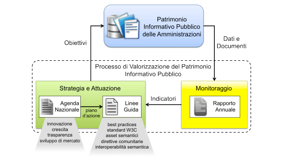
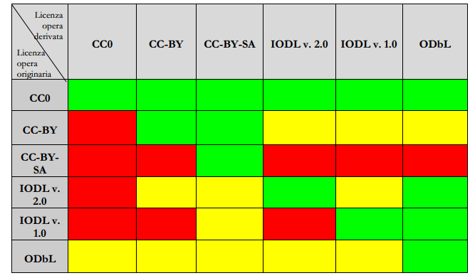

Open Data nella legislazione italiana
=====================================

Dall’entrata in vigore del Codice dell’Amministrazione Digitale, il corpo di regole introdotte nel 2006 per regolamentare le attività informatiche della Pubblica Amministrazione Italiana, il panorama digitale è cambiato sempre più rapidamente, e diverse riforme hanno variato i suoi articoli, notabilmente quella del Dlgs 30 Dicembre 2010 e il Decreto Crescita 2.0 convertito in legge il 18 Dicembre 2012. Proprio quest’ultima riforma è quella che dà una grande spinta al mondo dei dati aperti italiani, affidando all’Agenzia per l’Italia Digitale[^1] la redazione annuale di una Agenda Nazionale, delle Linee Guida e del Rapporto sullo stato dei dati aperti in Italia.

Riforma del Codice dell’Amministrazione Digitale
------------------------------------------------

La riforma del Codice dell’Amministrazione Digitale modifica due articoli in particolare che si relazionano al mondo dell’open source ed open data: l’articolo 68 (“Analisi comparativa delle soluzioni”[^2]) nell’analisi comparativa del software da acquistare dà priorità alle soluzioni open source rispetto alle soluzioni proprietarie e definisce cosa sono dati e formati aperti, mentre l’articolo 52 (“Accesso telematico e riutilizzo dei dati delle pubbliche amministrazioni”[^3]) introduce il cosiddetto principio dell’open by default nella legislazione italiana.

L’articolo 68 definisce i formati aperti come quelli che sono documentati esaustivamente e neutri rispetto agli strumenti per utilizzarli (ovvero non necessitano di un particolare programma informatico o una particolare piattaforma per consultarli ed elaborarli); mentre i dati aperti sono tali se:

-   hanno una licenza che permette il riuso anche commerciale in formato disaggregato;

-   sono accessibili sulle reti in formato aperto, provvisti di metadati ed elaborabili automaticamente;

-   se disponibili in rete devono essere liberamente scaricabili, altrimenti devono essere resi disponibili liberamente a meno dei costi (marginali) di riproduzione e di casi eccezionali deliberati dall’AgID.

L’articolo 52 regola l’accesso ai dati della PA, istituendo anche delle procedure annuali per l’AgID:

-   i dati delle pubbliche amministrazioni e delle società presenti nel conto consolidato dello Stato devono essere pubblicati nel rispettivo sito web nella sezione “Trasparenza, valutazione e merito” e l’attività di pubblicazione viene misurata nelle performance dei dirigenti;

-   i dati senza esplicita indicazione di licenza si intendono dati aperti (open by default);

-   gli appalti pubblici relativi alla raccolta o gestione di dati devono avere clausole che consentano rilascio e riutilizzo degli stessi;

-   l’AgID formula annualmente l’Agenda nazionale contenente gli obiettivi e i contenuti delle politiche di valorizzazione dei dati pubblici, e ne rende conto in un Rapporto annuale;

-   ogni anno l’AgID deve definire ed aggiornare le Linee Guida sugli standard tecnici per attuare il processo di pubblicazione delle informazioni pubbliche.

Agenda 2014
-----------

Il 9 Maggio 2014 è stata rilasciata l’Agenda nazionale per la valorizzazione del patrimonio informativo pubblico[^4], primo passo delle azioni annuali predisposte dal CAD.

L’obiettivo dichiarato dal documento è quello di superare l’autonomia nelle modalità di gestione del patrimonio informativo delle singole amministrazioni per uniformarlo e valorizzarlo individuando tre direttrici sulle quali si danno obiettivi e enti pubblici responsabili:

-   basi di dati di interesse nazionale;

-   convenzioni aperte tra pubbliche amministrazioni;

-   dati di tipo aperto.

I principi che regolano l’agenda sono: **fruibilità** (dei dati su reti telematica), **interoperabilità** (uso di formati standard), **qualità** (secondo lo standard ISO/IEC 25012), **accessibilità** (secondo altre normative), **gratuità** (a meno di eventuale costo di riproduzione), **riutilizzabilità** (le licenze permettono anche il riuso commerciale).

È facile notare che questi principi discendono dalla Open Definition, come le direttive delle linee guida da cui traggono ispirazione.

Nella terza sezione del documento si enunciano gli obiettivi del 2014 discendenti dalle direttrici:

-   espansione delle basi di dati di interesse nazionale con l’inclusione del Repertorio Nazionale dei Dati Territoriali;

-   agevolazione delle convenzione fra pubbliche amministrazioni (ad esempio Comune/forze di polizia) per l’utilizzo di servizi e dati creati dalle stesse;

-   apertura dei dati a meno di quelli a conoscibilità limitata (per privacy, segreto di stato e statistico) corredati di descrizione tramite metadati e a costo gratuito o marginale, dando priorità agli insiemi di dati considerati di interesse nazionale;

-   coinvolgimento della società civile nella apertura ed utilizzazione dei dati;

-   valorizzazione dei dati tramite formazione dei dirigenti pubblici, risoluzione delle incongruenze normative e finanziamento di iniziative mirate alla valorizzazione stessa.

Nella Tabella 1 dell’Agenda si trova l’elencazione dei dataset chiave, nella Tabella 2 i dataset considerati chiave dalla convenzione dell’Open Data Charter del G8, mentre nella Tabella 3 i dataset richiesti dalla società civile: per le prime due si individuano anche date di massima per il rilascio, a cominciare dalle informazioni aggregate sulle dimissioni dei pazienti ricoverati su scala nazionale (Ministero della Salute, Maggio 2014[^5]).

Linee guida 2014
----------------

Le Linee guida nazionali per la valorizzazione del patrimonio informativo pubblico[^6] costituiscono un documento aggiornato incrementalmente per fornire un supporto tecnico ed operativo ai soggetti previsti dal CAD al fine di realizzare gli obiettivi prefissati dall’agenda.

Nel terzo capitolo si definisce il quadro normativo nel quale si pongono le Linee guida e la relazione fra dati aperti e trasparenza (regolata da un altro decreto legislativo), per poi fare il punto sulla situazione dell’esperienza sul tema a livello regionale: si raccomanda di mantenere un ruolo di riferimento a livello nazionale per uniformare le varie regolamentazioni regionali.

Nel quarto capitolo si modella la categorizzazione dei dati (basandosi sulla scala di Tim Berners-Lee) e la metadatazione secondo altri decreti nazionali.

Nel quinto capitolo si danno linee di azione per il rilascio dei dati: si trattano dati prodotti dalla PA, dati mashup, linked open data, engagement (coinvolgimento interno ed esterno, secondo il modello di Tim Davies).

Nel sesto capitolo si dettagliano i formati da utilizzare e le ontologie per il rilascio di dati, ed i dataset di riferimento in vari ambiti.

Il settimo capitolo tratta della specifica della titolarità del dato, mentre l’ottavo delle licenze, raccomandando le licenze definite compatibili con il concetto di dati aperti (si veda la Tabella di confronto riprodotta alla fine di questa sezione): viene anche precisato il ruolo delle donazioni al pubblico dominio (o rinuncia al diritto d’autore), sconsigliandole per i documenti delle pubbliche amministrazioni in quanto in contrasto con il Codice dei beni culturali.

Nel nono capitolo si trattano gli aspetti economici della gestione dei dati: qui viene specificato che viene permesso il rilascio di dati a tariffa superiore al costo marginale solo se il rilasciante è un istituto culturale o se i dati sono necessari alla copertura dei costi dell’attività amministrativa (e l’analisi dei costi deve condursi secondo metodi verificati ed in trasparenza) e vengono proposti modelli di business a supporto delle decisioni.

Il decimo capitolo fornisce indicazioni sulla presentazione dei dati (dal punto di vista delle piattaforme e dei requisiti che esse devono avere a seconda del livello di pubblicazione desiderato, giungendo a discutere i requisiti per i linked open data). Infine nell’undicesimo si trattano i casi da gestire nei capitolati di gara.

****
[^1]: <http://www.agid.gov.it/>

[^2]: <http://www.altalex.com/index.php?idnot=51664#capo6>

[^3]: <http://www.altalex.com/index.php?idnot=51663#capo5>

[^4]: <http://www.agid.gov.it/notizie/patrimonio-informativo-pubblico-line-lagenda-nazionale-2014>

[^5]: Pubblicati sul portale open data <http://www.dati.salute.gov.it/>

[^6]: In versione finale sono state pubblicate il 27 Giugno 2014, <http://www.agid.gov.it/sites/default/files/linee_guida/patrimoniopubblicolg2014_v0.7finale.pdf>

